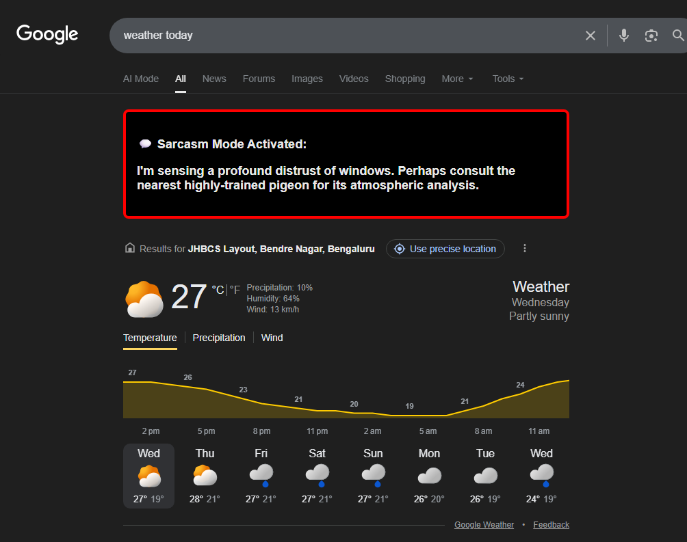
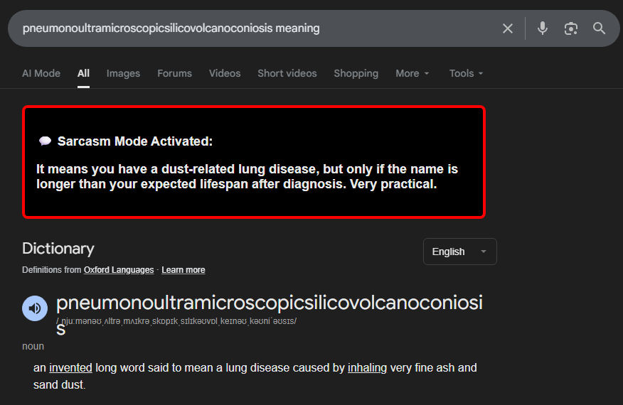

# SnarkySearch 🤖 - Your AI Search Rival

## 🌟 Overview

Ever felt like your search engine was too... helpful? Too neutral? Too polite?
Behold SnarkySearch, the browser extension that ensures you never get a straight answer without a healthy dose of digital sarcasm and meme-level wit. This extension uses the Gemini API to generate a custom, hilarious, or downright judgmental reply that sits right on top of your normal Google search results.

It's here to pull your leg, question your life choices, and occasionally deliver a perfect one-liner.

## ✨ Features

Query Interception: Extracts search queries directly from Google's result page.

AI-Powered Snark: Calls the Gemini API with a custom persona to generate short, witty, and sarcastic replies tailored to your exact search.

Seamless Injection: Injects the humorous response into a highly visible, custom-styled box right above the main results.

Humiliation Included: Free of charge.

## 🛠️ Installation

This extension is built for Chrome (and compatible with most Chromium-based browsers like Edge and Brave).

### Clone the Repository:

``git clone [your_repo_url]``

``cd SnarkySearch``

(Or download and unzip the file.)

### Add Your API Key (Crucial Step):

Open the file `content.js.`

Find the line `const apiKey = 'YOUR_API_KEY_HERE'`;

Replace the placeholder with your actual Gemini API Key. The extension cannot generate sarcasm without it!

### Load Extension in Chrome:

Navigate to `chrome://extensions/` in your Chrome browser.

Enable "Developer mode" in the top right corner.

Click on "Load unpacked" and select the root directory of your project (SnarkySearch).

## 🚀 Usage

Ensure the extension is enabled in your browser.

Perform any search on Google.

The sarcastic response will automatically appear at the top of the search results, just below the search bar.

## 💡 Example

---
## 🤝 Contributing

Feel free to submit issues or pull requests for:

Better Snark: Refining the Gemini system prompt for even better comedic effect.

New Search Engine Support: Adding compatibility for DuckDuckGo, Bing, etc.

Bug Fixes: Stopping the AI from being too mean.

## 📜 License

This project is licensed under the MIT License.